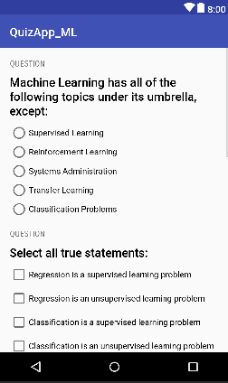

# ABND-Proj3-Machine-Learning-Quiz-App

The third project in the Android Basics nanodegree by Google and Udacity: "**Quiz App**".
It is an application on the learnt concepts of binding the layout and java code in the second course "User Input".

***

  

***

## Udacity's Project Overview:

You will be making your own Android app - taking it from the idea stage to building out the full app. You can share your app with family and friends, as well as with other students in this course.

The goal is to create an educational app that quizzes a user about a certain topic of your choice. We want you to be creative about how you accomplish this. It’s up to you what the quiz questions will be about and how you want to present them to your user. (Per the rubric, we require a minimum of 4 questions and a maximum of 10 quiz questions for a proper app submission).

 [Project Rubric](https://review.udacity.com/#!/rubrics/158/view)

## App Overview:

The app is a simple 5-qustions quiz on Machine Learning that grades user's answers and shows the score upon completion of the quiz. It includes different types of questions like Radio group questions and Check box questions.

## Android Features:

1. Nested Layouts.
2. XML Strings.
3. Radio Group and Check Box.
4. Toast Messages.